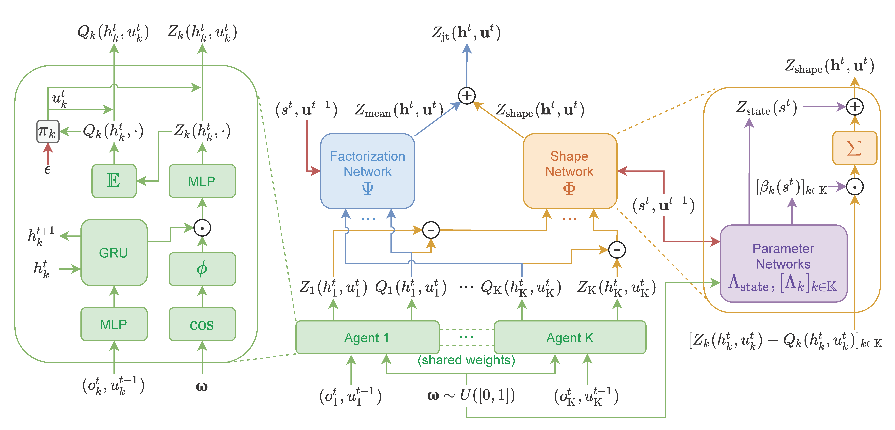

# Distributional Value Function Factorization Framework

## Abstract

In fully cooperative multi-agent reinforcement learning (MARL) settings, the environments are highly stochastic due to the partial observability of each agent and the continuously changing policies of the other agents. To address the above issues, we integrate distributional RL and value function factorization methods by proposing a Distributional Value Function Factorization (DFAC) framework to generalize expected value function factorization methods to their distributional variants. DFAC extends the individual utility functions from deterministic variables to random variables, and models the quantile function of the total return as a quantile mixture. To validate DFAC, we demonstrate DFAC’s ability to factorize a simple two-step matrix game with stochastic rewards and perform experiments on all Super Hard tasks of StarCraft Multi-Agent Challenge, showing that DFAC is able to outperform expected value function factorization baselines.



## Video of Learned Policy (by DDN)

<iframe width="789" height="444" src="https://www.youtube.com/embed/MLdqyyPcv9U" title="YouTube video player" frameborder="0" allow="accelerometer; autoplay; clipboard-write; encrypted-media; gyroscope; picture-in-picture" allowfullscreen></iframe>

## Citation

Bibtex:


```
@InProceedings{sun21dfac,
  title = 	 {{DFAC} Framework: Factorizing the Value Function via Quantile Mixture for Multi-Agent Distributional Q-Learning},
  author =       {Sun, Wei-Fang and Lee, Cheng-Kuang and Lee, Chun-Yi},
  booktitle = 	 {Proceedings of the 38th International Conference on Machine Learning},
  pages = 	 {9945--9954},
  year = 	 {2021},
  volume = 	 {139},
  series = 	 {Proceedings of Machine Learning Research},
  month = 	 {18--24 Jul},
  publisher =    {PMLR},
  pdf = 	 {http://proceedings.mlr.press/v139/sun21c/sun21c.pdf},
  url = 	 {http://proceedings.mlr.press/v139/sun21c.html},
}
```


## Links

- [Paper on arXiv](https://arxiv.org/abs/2102.07936)
- [Paper on PMLR](http://proceedings.mlr.press/v139/sun21c.html)
- [Source Code](https://github.com/j3soon/dfac)
- [Paper with Code](https://paperswithcode.com/paper/dfac-framework-factorizing-the-value-function)
  - [](https://paperswithcode.com/sota/smac-on-smac-6h-vs-8z-1?p=dfac-framework-factorizing-the-value-function)
  - [](https://paperswithcode.com/sota/smac-on-smac-3s5z-vs-3s6z-1?p=dfac-framework-factorizing-the-value-function)
  - [](https://paperswithcode.com/sota/smac-on-smac-mmm2-1?p=dfac-framework-factorizing-the-value-function)
  - [](https://paperswithcode.com/sota/smac-on-smac-27m-vs-30m?p=dfac-framework-factorizing-the-value-function)
  - [](https://paperswithcode.com/sota/smac-on-smac-corridor?p=dfac-framework-factorizing-the-value-function)
- QRCode of this webpage

  [](https://j3soon.github.io/dfac)

  (made by [qrcodemonkey](https://www.qrcode-monkey.com/))